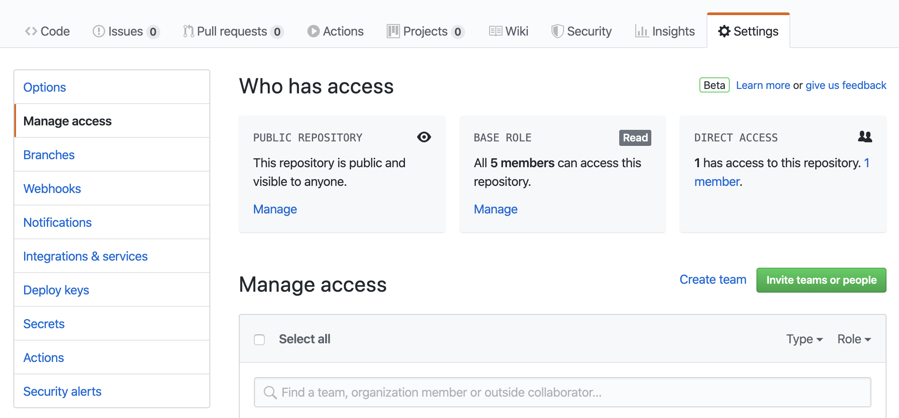

## Collaborating on GitHub
For the next step, get into pairs.  One person will be the "Owner" and the other
will be the "Collaborator". The goal is for the Collaborator to add changes into
the Owner's repository. If there is time we will switch roles at the end so everyone can play Owner and Collaborator.

First the Owner needs to give the Collaborator access to their repository.
On GitHub, click the settings button on the right,
then select Collaborators, and enter your partner's GitHub username.

To accept access to the Owner's repo the Collaborator
needs to go to [https://github.com/notifications](https://github.com/notifications).

Next, the Collaborator needs to download a copy of the Owner's repository to their computer. This is called "cloning" a repository. To clone the Owner's "hello-world" repository onto
their `Desktop` the Collaborator would enter this command:

Input
{: .label .label-green}
~~~
$ git clone https://github.com/<owner's-github-username>/hello-world.git ~/Desktop/owner-hello-world
~~~

The Collaborator can now make changes in their clone of the Owner's repository using the commands introduced earlier.

- use `cd` to navigate to the cloned repository
- use `touch` to create a new file in the repository
- add a few lines to the file using a text editor
- use `git add` to stage the file
- use `git commit -m "Commit note"` to commit the changes

Then push the Collaborator's change(s) to the *Owner's* repository on GitHub:

Input
{: .label .label-green}
~~~
$ git push origin master
~~~

Note that this time we didn't have to create a remote called `origin`: Git uses this
name by default when we clone a repository.  (This is why `origin` was a
sensible choice for a nickname earlier when we were setting up remotes by hand.)

Take another look to the Owner's repository on the GitHub website (you might need
to refresh your browser). You should be able to see the new commit made by the
Collaborator.

To download the Collaborator's changes from GitHub, the Owner now enters this command on their own computer:

Input
{: .label .label-green}
~~~
$ git pull origin master
~~~

Now the three repositories - Owner's local, Collaborator's local, and Owner's on
GitHub - are back in sync.

___Switch Owner and Collaborator roles if time permits and you'd like more practice___

## A Basic Collaborative Workflow

When collaborating it's important to work from an updated version of the repository so you should `git pull` before making
any changes. A basic workflow for collaboration might look like this:

* update your local repo with `git pull origin master`,
* make your changes and stage them with `git add`,
* commit your changes with `git commit -m`, and
* upload the changes to GitHub with `git push origin master`
